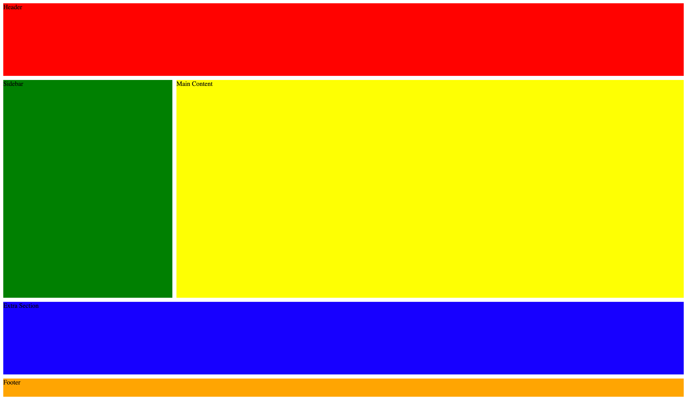
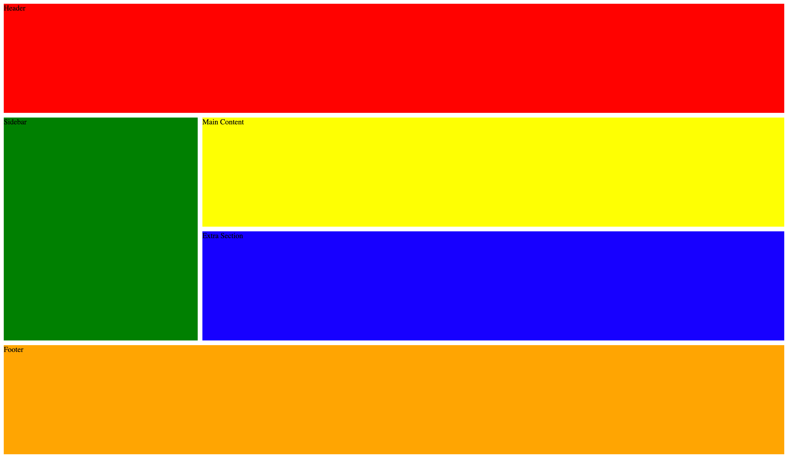

## **U05-CW14 - CSS Grid **

### Objective:

Students will apply **CSS Grid properties** from **Lecture 13 & 14** to **structure two layouts** using `grid-column`, `grid-row`, `grid-area`, `order`, and `span`.

---

## Challenge 1: Two-Column Layout

📌 **Goal:**

- The **header spans the full width**.
- The **sidebar is on the left**, and the **main content takes up the rest**.
- An **extra section** is placed under the sidebar, spanning all columns.
- The **footer spans the entire width**.

---
#### **📝 Instructions**

#### **1️⃣ Open Your HTML File**

- Use the provided `index.html` file.

#### **2️⃣ Open Your CSS File**

- Create a new file named **`challenge1.css`**.

---

#### **3️⃣ Define the Grid Container**

- Add a comment at the top of your file indicating that you are defining the **grid container**.
- Select the `.container` class to define the parent **grid layout**.
- Set the **display property** to enable CSS Grid.
- Define a template for a **two column** layout where the first value is 1fr and the second value is 3 times larger.
- Define **four rows**, where the values are 1fr 3fr 1fr and 0.25fr.
- Add **a gap** between grid items to 10px.
- Set the **height** of the grid container to 100vh.

---

#### **4️⃣ Style the Header**

- Add a comment indicating you are styling the **header section**.
- Select the `.header` class.
- Make the **header span across both columns** so it stretches across the **full width** of the layout.
- Assign a **background color** to red.

---

#### **5️⃣ Position the Sidebar**

- Add a comment indicating you are styling the **sidebar section**.
- Select the `.sidebar` class.
- Place the **sidebar in the first column**.
- Position the **sidebar in the second row** so it sits **below the header**.
- Assign a **background color** to green.

---

#### **6️⃣ Position the Main Content**

- Add a comment indicating you are styling the **main content section**.
- Select the `.content` class.
- Place the **main content in the second column**.
- Position it **in the second row**, next to the **sidebar**.
- Assign a **background color** yellow.

---

#### **7️⃣ Place the Extra Section**

- Add a comment indicating you are styling the **extra section**.
- Select the `.extra` class.
- Make the **extra section span across all columns** to match the **header width**.
- Position it **below the sidebar and main content** in the **third row**.
- Assign a **background color** to blue.

---

#### **8️⃣ Style the Footer**

- Add a comment indicating you are styling the **footer section**.
- Select the `.footer` class.
- Make the **footer span across all columns** to match the **header width**.
- Assign a **background color** to orange.

---

### Challenge 2: Dashboard Layout with Sidebar and Content

📌 **Goal:**

- The **header spans the top**.
- The **sidebar spans the full height on the left**.
- The **main content and extra section are both to the right of the sidebar**.
- The **footer spans the full width** at the bottom.

### **📝 Instructions**

#### **1️⃣ Open Your CSS File**

- Create a new file named **`challenge2.css`**.
- In the `index.html` file, comment out the first link tag for challenge1.css.
- Uncomment the second link take to make challenge2.css active.

#### **2️⃣ Define the Grid Container**
- Add a comment at the top of your file indicating that you are defining the **grid container**.
- Select the `.container` class to define the **grid container**.
- Set the **display property** to enable CSS Grid.
- Define a template for a **two column** layout where the first value is 1fr and the second value is 3 times larger.
- Define **four rows** that repeats the height to be evenly distributed.
- Add a **gap** to 10px
- Set the **height** of the container to take up the **full screen height**.

---

#### **3️⃣ Style the Header**
- Add a comment indicating you are styling the **header section**.
- Select the `.header` class.
- Make the **header span across both columns** to **cover the full width** of the layout.
- Assign a **background color** to red.

---

#### **4️⃣ Position the Sidebar**
- Add a comment indicating you are styling the **sidebar section**.
- Select the `.sidebar` class.
- Place the **sidebar in the first column**.
- Make the **sidebar span from row 2 to row 4**, so it stays **fixed on the left** and stretches from the **content area down to the footer**.
- Assign a **background color** to green.

---

#### **5️⃣ Position the Main Content**
- Add a comment indicating you are styling the **main content section**.
- Select the `.content` class.
- Place the **main content in the second column**.
- Position it **in the second row**, next to the **sidebar**.
- Assign a **background color** to yellow.

---

#### **6️⃣ Place the Extra Section**
- Add a comment indicating you are styling the **extra section**.
- Select the `.extra` class.
- Place the **extra section in the second column**, **below the main content**.
- Position it **in the third row** next to the **sidebar**.
- Assign a **background color** to blue.

---

#### **7️⃣ Style the Footer**
- Add a comment indicating you are styling the **footer section**.
- Select the `.footer` class.
- Make the **footer span across both columns** to match the **header width**.
- Assign a **background color** to orange.

---

#### **📌 Bonus Challenge**

- Experiment with `grid-area` to replace `grid-column` and `grid-row`. Modify your layouts to use **named grid areas** instead.
- Play around with the `order` of the elements on mobile view vs desktop view.

---

## **📌 Submit Your Work**

Once you've confirmed that the button works and looks good, submit the following files inside Google Classroom:
   - `challenge1.css` (for the first layout)
   - `challenge2.css` (for the second layout)
---
